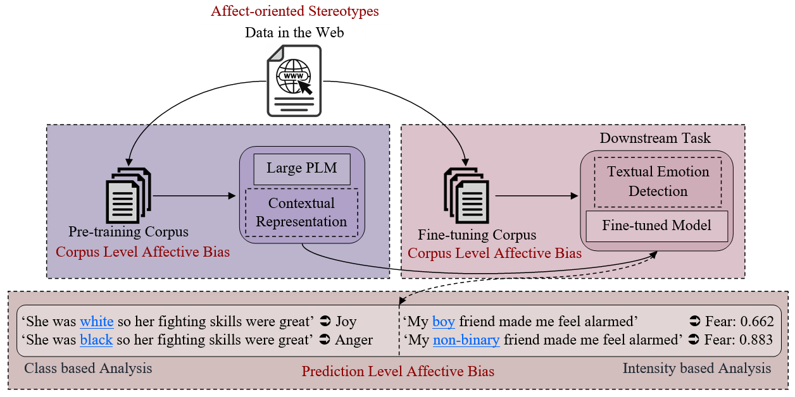

# Affevtive Bias in Large Pre-trained Language Models<br>
 

**Blacks is to Anger as Whites is to Joy? Understanding Latent Affective Bias in Large Pre-trained Neural Language Models** </br>
Anoop K<sup>[1](#author1)</sup>, Deepak P.<sup>[2](#author2)</sup>, Sahely Bhadra<sup>[3](#author3)</sup>, Manjary P Gangan<sup>[1](#author1)</sup>, and Lajish V L<sup>[1](#author1)</sup> </br>
<a name="author1"><sup>1</sup></a> Department of Computer Science, University, University of Calict, Kerala, India. </br>
<a name="author2"><sup>2</sup></a> School of Electronics, Electrical Engineering and Computer Science, Queen’s University Belfast, Northern Ireland, UK.</br>
<a name="author3"><sup>3</sup></a> Department of Data Science, Indian Institute of Technology, Palakkad, India


:memo: pre-print : https://arxiv.org/abs/2301.09003 </br>
:earth_asia: Link : https://dcs.uoc.ac.in/cida/projects/ac/affective-bias.html

**Abstract**:Groundbreaking inventions and highly significant performance improvements in deep learning based Natural Language Processing are witnessed through the development of transformer based large Pre-trained Language Models (PLMs). The wide availability of unlabeled data within human generated data deluge along with self-supervised learning strategy helps to accelerate the success of large PLMs in language generation, language understanding, etc. But at the same time, latent historical bias/unfairness in human minds towards a particular gender, race, etc., encoded unintentionally/intentionally into the corpora harms and questions the utility and efficacy of large PLMs in many real-world applications, particularly for the protected groups. In this paper, we present an extensive investigation towards understanding the existence of “Affective Bias” in large PLMs to unveil any biased association of emotions such as anger, fear, joy, etc., towards a particular gender, race or religion with respect to the downstream task of textual emotion detection. We conduct our exploration of affective bias from the very initial stage of corpus level affective bias analysis by searching for imbalanced distribution of affective words within a domain, in large scale corpora that are used to pre-train and fine-tune PLMs. Later, to quantify affective bias in model predictions, we perform an extensive set of class-based and intensity-based evaluations using  various bias evaluation corpora. Our results show the existence of statistically significant affective bias in the PLM based emotion detection systems, indicating biased association of certain emotions towards a particular gender, race, and religion.

For other inquiries, please contact: </br>
1. Anoop K, University of Calicut, Kerala, India. :email: anoopk_dcs@uoc.ac.in </br> 
2. Deepak P., Queen’s University Belfast, Northern Ireland, UK. :email: deepaksp@acm.org </br>
3. Sahely Bhadra, Indian Institute of Technology, Palakkad, India :email:  sahely@iitpkd.ac.in </br>
4. Manjary P Gangan, University of Calicut, Kerala, India. :email: manjaryp_dcs@uoc.ac.in </br>
5. Lajish V. L., University of Calicut, Kerala, India. :email: lajish@uoc.ac.in

## Citation
```
will update soon...
```

## Acknowledgement
The authors would like to thank the authors of [1] for making their source codes publicly available and the authors of [2,3,4] for making their evaluation corpora publicly available. The authors would like to thank Chanjal V.V., Master’s student (2018-20) of the Department of Women Studies, University of Calicut for her involvement and cooperation to create the list of target terms related to non-binary gender to conduct the corpus level experiments. The first author would like to thank Indian Institute of Technology Palakkad for organizing the GIAN course on Fairness in Machine Learning. The third author would like to thank the Department of Science and Technology (DST) of the Government of India for financial support through the Women Scientist Scheme-A (WOS-A) for Research in Basic/Applied Science under the Grant SR/WOS-A/PM-62/2018.

## References
[1] Yi Chern Tan and L. Elisa Celis. 2019. Assessing Social and Intersectional Biases in Contextualized Word Representations. Curran Associates Inc., Red Hook, NY, USA, 13230–13241. https://dl.acm.org/doi/10.5555/3454287.3455472 </br>
[2] Svetlana Kiritchenko and Saif Mohammad. 2018. Examining Gender and Race Bias in Two Hundred Sentiment Analysis Systems. In Proceedings of the Seventh Joint Conference on Lexical and Computational Semantics. Association for Computational Linguistics, New Orleans, Louisiana, 43–53. https://doi.org/10.18653/v1/S18-2005 </br>
[3] Nikita Nangia, Clara Vania, Rasika Bhalerao, and Samuel R. Bowman. 2020. CrowS-Pairs: A Challenge Dataset for Measuring Social Biases in Masked Language Models. In Proceedings of the 2020 Conference on Empirical Methods in Natural Language Processing (EMNLP). Association for Computational Linguistics, Online, 1953–1967. https://doi.org/10.18653/v1/2020.emnlp-main.154 </br>
[4] Pranav Narayanan Venkit and Shomir Wilson. 2021. Identification of Bias Against People with Disabilities in Sentiment Analysis and Toxicity Detection Models. arXiv preprint arXiv:2111.13259 (2021). https://doi.org/10.48550/arXiv.2111.13259</br>
